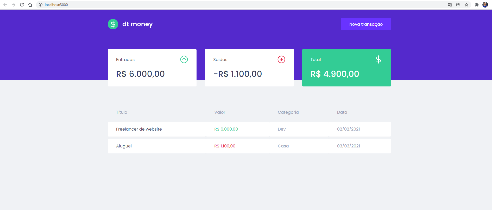
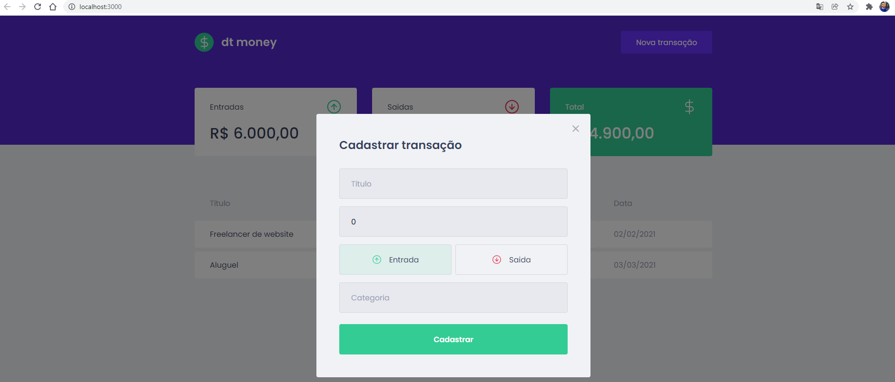

<div align="center" id="top"> 
  

&#xa0;

</div>

<h1 align="center">Ignite Chapter 2 - ReactJS</h1>
<h2 align="center">dt money - Controle de transações</h2>


<p align="center">
  <a href="#dart-sobre">Sobre</a> &#xa0; | &#xa0; 
  <a href="#sparkles-o-que-foi-aprendido">O que foi aprendido</a> &#xa0; | &#xa0;
  <a href="#rocket-tecnologias">Tecnologias</a> &#xa0; | &#xa0;
  <a href="#white_check_mark-pré-requesitos">Pré requisitos</a> &#xa0; | &#xa0;
  <a href="#checkered_flag-começando">Começando</a> &#xa0; | &#xa0;
  <a href="#film_strip-demonstração">Demo</a> &#xa0; | &#xa0;
  <a href="#memo-licença">Licença</a> &#xa0; | &#xa0;
</p>

<br>

## :dart: Sobre

Segundo projeto criado no Ignite - trilha ReactJS.
Onde criamos uma aplicação web, na qual podemos inserir nossas entradas e saídas de recebíveis, utilizando dos fundamentos aprendidos anteriormente no módulo 1 e outros conceitos e ferramentas.

## :sparkles: O que foi aprendido

- [x] Styled Components;
- [x] MirageJs;
- [x] Context API;
- [x] Hooks;
- [x] Axios;

## :rocket: Tecnologias

As seguintes ferramentas foram usadas na construção do projeto:

- [React](https://pt-br.reactjs.org/)
- [Styled Components](https://styled-components.com/)
- [MirageJS](https://miragejs.com/)
- [Axios](https://axios-http.com/docs/intro)
- [TypeScript](https://www.typescriptlang.org/)

## :checkered_flag: Começando

```bash
# Clone este repositório
$ git clone https://github.com/chardwillian/dtmoney
# Entre na pasta
$ cd dtmoney
# Instale as dependências
$ yarn
# Para iniciar o projeto
$ yarn start
# O app vai inicializar em <http://localhost:3000>
```

## :film_strip: Demonstração

A página de dashboard é essa abaixo


após clicar no botão nova transação abre-se o modal para criação da nova transação



é só preencher os campos e cadastrar.

## :memo: Licença

Este projeto está sob licença MIT. Veja o arquivo [LICENSE](LICENSE) para mais detalhes.

Feito com :heart: por <a href="https://github.com/chardwillian" target="_blank">Chard Willian</a>

&#xa0;

<a href="#top">Voltar para o topo</a>